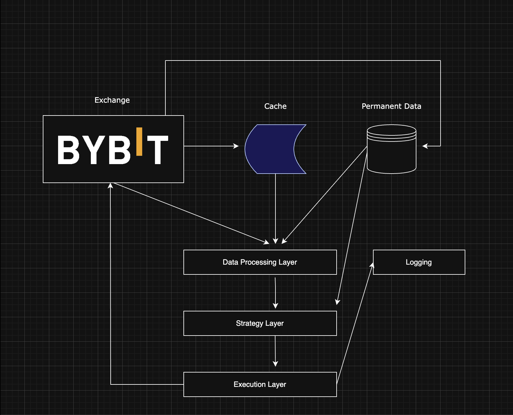

# Systematic Trading System
Algorithmic Trading system for quantitative trading of perpetual future derivaties. This system is entirely systematic, meaning I am not involving any discretionary decision behind taking on positions. I have not pushed the strategies to this repository, but the basic idea is the following. 

I view a systematic strategy as a function $S(d): R^n \to R$ which maps a multidimensional tuple of data to some output signal. The signal serves as the main component of some trading decision, which is handled by the execution layer. I have included a basic diagram of the system architecture below.

